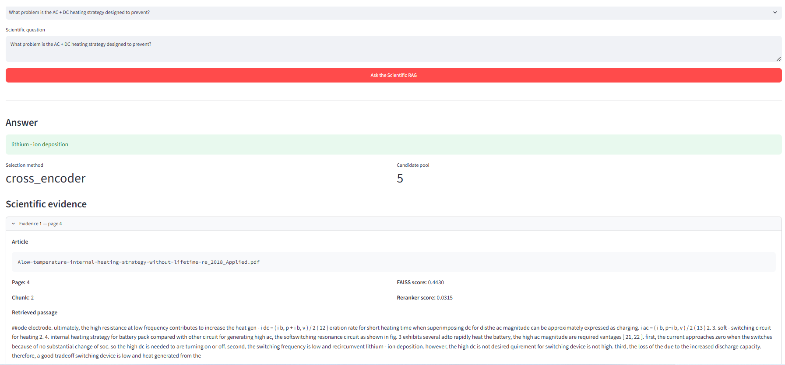
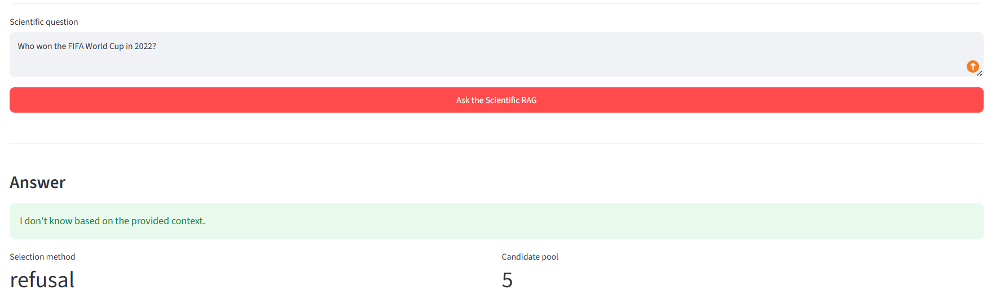

# Scientific Battery RAG

A local Retrieval-Augmented Generation (RAG) system for question answering over scientific battery literature.

The project combines scientific PDF processing, dense semantic retrieval, FAISS vector search, Cross-Encoder reranking, grounded answer generation, and out-of-domain refusal.

The goal is not to build a general-purpose chatbot, but to demonstrate a reproducible scientific NLP pipeline capable of answering questions from a controlled research corpus while exposing the evidence used to generate each answer.

---

## Project Overview

Scientific papers contain valuable technical information, but finding precise answers across multiple publications can be time-consuming.

This project builds a lightweight scientific question-answering system that:

1. Extracts text from battery research papers
2. Cleans and splits the text into overlapping token-aware chunks
3. Creates semantic embeddings
4. Retrieves candidate passages with FAISS
5. Reranks candidates using a Cross-Encoder
6. Generates a concise answer from the selected scientific evidence
7. Returns the source paper, page, and passage used
8. Refuses clearly out-of-domain questions

The current demonstration corpus contains five scientific papers related to lithium-ion batteries, battery lifetime, thermal behavior, photovoltaic-battery systems, and energy-system optimization.

---

## Main Use Case

A researcher, engineer, startup, or technical team can ask questions such as:

> What degradation mechanisms are considered in the fractional-order battery model?

> What problem is the AC + DC heating strategy designed to prevent?

> Which three states were investigated in detail for photovoltaic size, battery capacity, performance, and cost?

> What optimization method is used to evaluate all possible combinations of components and control strategies?

The system retrieves evidence from the indexed papers before generating the answer. For questions unrelated to the scientific corpus, the system abstains rather than generating an unsupported answer.

---

## Architecture

```text
Scientific PDFs
      |
      v
PyMuPDF extraction
      |
      v
Text cleaning
      |
      v
Token-aware overlapping chunks
      |
      v
MiniLM embeddings
      |
      v
FAISS semantic retrieval
      |
      v
Cross-Encoder reranking
      |
      v
Relevance / OOD gate
      |
      v
FLAN-T5-base
      |
      v
Grounded answer + source + page + evidence
```

---

## Technology Stack

**NLP and Machine Learning**
- Python
- PyTorch
- Hugging Face Transformers
- Sentence Transformers
  - `sentence-transformers/all-MiniLM-L6-v2`
  - `cross-encoder/ms-marco-MiniLM-L-6-v2`
  - `google/flan-t5-base`

**Retrieval**
- FAISS
- Normalized dense embeddings
- Cosine-style similarity through inner-product search
- Cross-Encoder reranking

**Scientific document processing**
- PyMuPDF
- ftfy
- Token-aware chunking with overlapping windows

**Application**
- Streamlit

---

## Scientific Corpus Pipeline

The corpus is built from scientific PDFs using:

```bash
python build_scientific_corpus.py
```

The pipeline performs two main stages.

### 1. PDF extraction

Each PDF is processed page by page with PyMuPDF. For every extracted page, the pipeline preserves:

- Source filename
- Page number
- Extracted text

### 2. Scientific preprocessing

The extracted text is:

- Repaired with ftfy
- Normalized for PDF whitespace
- Cleaned from line breaks
- Reconnected when words are broken by line-end hyphenation
- Split using the MiniLM tokenizer

Current chunking configuration:

| Parameter | Value |
|---|---|
| Maximum chunk size | 240 tokens |
| Overlap / stride | 60 tokens |

Each final chunk stores: `source_file`, `page`, `chunk_id`, `text`, `n_tokens`.

The current scientific corpus contains **5 scientific papers** and **369 indexed chunks**.

---

## Retrieval Pipeline

The first retrieval stage uses `sentence-transformers/all-MiniLM-L6-v2`. Each scientific chunk is converted into a dense vector, normalized, and indexed with FAISS using inner-product similarity.

```text
Question
   |
   v
MiniLM query embedding
   |
   v
FAISS
   |
   v
Top candidate passages
```

### Cross-Encoder Reranking

Dense retrieval is followed by reranking with `cross-encoder/ms-marco-MiniLM-L-6-v2`, which evaluates each question-passage pair more precisely than the initial bi-encoder retrieval stage.

The candidate pool size was not selected arbitrarily. An ablation experiment compared candidate pools of 5, 10, 20, and 30. Increasing retrieval depth improved recall but also introduced more distractors for the reranker.

**Candidate-Pool Ablation**

| Candidate pool | Hit@pool | Hybrid selection accuracy |
|---|---|---|
| 5 | 0.773 | 0.682 |
| 10 | 0.818 | 0.636 |
| 20 | 0.909 | 0.636 |
| 30 | 0.955 | 0.591 |

This illustrates an important retrieval trade-off: a larger candidate set improves recall, but does not necessarily improve the final passage selected by the reranker. The final RAG therefore uses `candidate_pool = 5`.

---

## Out-of-Domain Refusal

The system includes a first-stage relevance gate. If the highest FAISS similarity score is below **0.30**, the system returns:

> I don't know based on the provided context.

instead of sending unrelated evidence to the generation model.

**Example**

- Question: *Who won the FIFA World Cup in 2022?*
- Answer: *I don't know based on the provided context.*

---

## Grounded Answer Generation

The final generator is `google/flan-t5-base`. The prompt instructs the model to:

- Use only the retrieved evidence
- Preserve scientific terms
- Preserve numerical values and units
- Provide concise answers
- Avoid unsupported explanations
- Abstain when the answer is absent from the evidence

The generator runs locally on CPU.

### Generator Model Experiment

The first prototype used `google/flan-t5-small`. An oracle experiment was then performed in which the generator received manually validated gold evidence.

| Generator | Oracle Token F1 |
|---|---|
| FLAN-T5-small | 0.353 |
| FLAN-T5-base | 0.482 |

FLAN-T5-base therefore replaced FLAN-T5-small in the final pipeline. This experiment separates generation quality from retrieval quality because the generator receives a known relevant passage directly.

---

## Evaluation Dataset

The scientific benchmark currently contains **25 questions**, including:

- 15 direct answerable questions
- 7 paraphrased scientific questions
- 3 out-of-domain questions

The questions cover all five papers in the scientific corpus. Relevant passages were manually annotated using `source_file`, `page`, and `chunk_id`. Multiple overlapping chunks can be marked as relevant for the same question.

The benchmark is stored in `data/evaluation/scientific_eval.jsonl`.

---

## Retrieval Results

Final retrieval configuration:

- **Embedding model:** `sentence-transformers/all-MiniLM-L6-v2`
- **Vector index:** FAISS `IndexFlatIP`
- **Reranker:** `cross-encoder/ms-marco-MiniLM-L-6-v2`
- **Candidate pool:** 5
- **OOD relevance threshold:** 0.30

Current retrieval benchmark:

| Metric | Result |
|---|---|
| Hit@1 | 0.273 |
| Hit@3 | 0.591 |
| Hit@5 | 0.773 |
| MRR@5 | 0.455 |
| Hybrid source-selection accuracy | 0.682 |
| OOD refusal accuracy | 1.000 |

---

## End-to-End RAG Results

The complete pipeline was evaluated as:

```text
Question
   |
   v
Dense retrieval
   |
   v
Cross-Encoder reranking
   |
   v
Selected evidence
   |
   v
FLAN-T5-base
   |
   v
Generated answer
```

Current results:

| Metric | Result |
|---|---|
| Average Token F1 | 0.463 |
| Correct source selection | 0.682 |
| OOD refusal accuracy | 1.000 |

These results should be interpreted cautiously because the benchmark contains only 25 questions. They demonstrate the behavior of this specific scientific corpus and configuration, not general-domain RAG performance.

### Why Token F1 Is Not Sufficient Alone

Lexical metrics can underestimate scientifically correct answers. For example:

- Generated: *"by using lumped-parameter method"* — Reference: *"a lumped-parameter approach"*
- Generated: *"50"* — Reference: *"all 50 U.S. states"*

The meaning can be correct even when lexical overlap is imperfect, or the answer can contain the required information without producing a perfect Token F1 score. For this reason, Token F1 is treated as one diagnostic metric rather than a complete measure of answer quality.

---

## Known Limitations

**Small evaluation set**
The benchmark contains only 25 questions. The reported scores should therefore not be interpreted as statistically robust general performance.

**Small scientific corpus**
The current demonstration uses five papers. A production deployment would require a substantially larger and more diverse document collection.

**Generic embedding model**
`all-MiniLM-L6-v2` is lightweight and practical, but is not specifically trained for scientific battery literature. Some relevant passages appear outside the top five retrieval results.

**Reranker errors**
The Cross-Encoder improves many queries but can also select a distractor. The candidate-pool experiment showed that this effect becomes stronger as more candidates are introduced.

**Lightweight local generator**
FLAN-T5-base is intentionally selected to remain usable on CPU hardware. Larger instruction-tuned models may improve generation quality but require more computational resources.

**Simple out-of-domain threshold**
The current refusal mechanism is based on a manually selected FAISS similarity threshold. The 100% OOD result currently corresponds to only three obvious out-of-domain questions. Additional hard-negative and in-domain-unanswerable evaluation would be required for production deployment.

---

## Project Structure

```text
Semantic-search-chatbot/
|
|-- app/
|   `-- app.py
|
|-- data/
|   |-- evaluation/
|   |   `-- scientific_eval.jsonl
|   |
|   `-- scientific/
|       |-- pdf/          # local source PDFs, not committed
|       |-- text/         # generated extraction, not committed
|       `-- processed/    # generated chunks, not committed
|
|-- src/
|   |-- embeddings.py
|   |-- evaluation.py
|   |-- generator.py
|   |-- pdf_extraction.py
|   |-- preprocessing.py
|   |-- rag.py
|   |-- reranker.py
|   |-- retrieval.py
|   |-- scientific_preprocessing.py
|   `-- vector_store.py
|
|-- build_scientific_corpus.py
|-- compare_candidate_pools.py
|-- evaluate_oracle_generation.py
|-- evaluate_scientific_rag.py
|-- evaluate_scientific_retrieval.py
|-- test_scientific_rag.py
|-- requirements.txt
`-- README.md
```

---

## Installation

Clone the repository:

```bash
git clone <repository-url>
cd Semantic-search-chatbot
```

Create a virtual environment (Windows PowerShell):

```powershell
python -m venv .venv
.venv\Scripts\Activate.ps1
```

Install dependencies:

```bash
python -m pip install -r requirements.txt
```

---

## Building the Scientific Corpus

Scientific source PDFs are intentionally not stored in the public repository. Place your own PDF documents in:

```text
data/scientific/pdf/
```

Then run:

```bash
python build_scientific_corpus.py
```

This produces:

- `data/scientific/text/`
- `data/scientific/processed/scientific_chunks.jsonl`

---

## Running the Scientific Retrieval Evaluation

```bash
python evaluate_scientific_retrieval.py
```

The evaluation reports:

- Hit@1
- Hit@3
- Hit@5
- MRR@5
- Hybrid selection accuracy
- OOD refusal accuracy

---

## Running the End-to-End RAG Evaluation

```bash
python evaluate_scientific_rag.py
```

The evaluation reports:

- Average Token F1
- Source accuracy
- OOD refusal accuracy

---

## Running the Oracle Generation Evaluation

```bash
python evaluate_oracle_generation.py
```

This experiment bypasses retrieval and provides manually annotated evidence directly to the generator. It is useful for separating retrieval errors from generation errors.

---

## Reproducing the Candidate-Pool Experiment

```bash
python compare_candidate_pools.py
```

The experiment compares candidate pools of 5, 10, 20, and 30, and measures the trade-off between retrieval recall and final reranker accuracy.

---

## Running the Streamlit Demo

```bash
python -m streamlit run app/app.py
```

The application provides:

- A scientific question input
- Generated answer
- Selected source
- Source page
- Chunk identifier
- FAISS similarity
- Cross-Encoder reranking score when available
- Retrieved scientific passage
- Evaluation metrics

---

### Demo Screenshots

#### Grounded scientific answer

The application retrieves scientific evidence, generates a concise answer, and exposes the source passage used by the RAG system.

**Example**

- Question: *What problem is the AC + DC heating strategy designed to prevent?*
- Answer: *lithium-ion deposition*



#### Out-of-domain refusal

When the retrieved evidence is not sufficiently relevant, the system refuses the question instead of generating an unsupported answer.



---

## What This Project Demonstrates

This project demonstrates practical experience with:

- Scientific NLP
- Retrieval-Augmented Generation
- Document ingestion
- PDF text extraction
- Text preprocessing
- Token-aware chunking
- Semantic embeddings
- FAISS vector search
- Cross-Encoder reranking
- Grounded generation
- Hallucination mitigation
- Out-of-domain detection
- Experimental evaluation
- Ablation studies
- Model comparison
- Reproducible ML workflows
- Streamlit application development

---

## Future Improvements

Potential extensions include:

- Scientific-domain embedding models
- Stronger rerankers
- Hybrid dense + BM25 retrieval
- Metadata filtering
- Section-aware scientific chunking
- Larger scientific corpora
- Hard-negative OOD benchmarks
- Citation-level answer verification
- Semantic answer evaluation
- Stronger local instruction-tuned language models
- Persistent vector indexes
- Automated ingestion pipelines

---

## Disclaimer

This repository is a research and portfolio prototype. The scientific benchmark is intentionally small, and the reported metrics describe only the current experimental corpus and configuration.

The system should not be used as a source of medical, safety-critical, or operational battery advice without independent expert verification.

---

## License

See the `LICENSE` file for repository licensing information.
